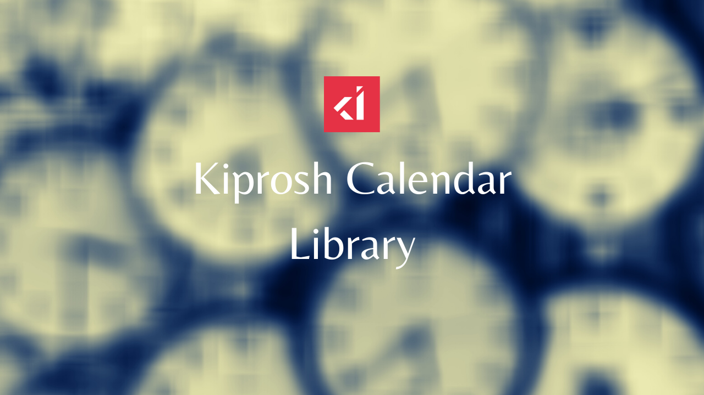

# Kiprosh Calendar Library
Kiprosh Calendar Library is an open source material designed calendar made for everyone!

[](https://f-droid.org/packages/ws.xsoh.etar/)[](https://play.google.com/store/apps/details?id=ws.xsoh.etar)


## Why?
Well, I wanted a simple, material designed and state of the art open source calendar that anyone can make better.

## Special thanks

The application is an enhanced version of Kiprosh Calendar Library Calendar Library. Without the help of
[Free Software for Android](https://github.com/Kiprosh Calendar Library-Group/Kiprosh Calendar Library-Calendar) team, 
this app would be just a dream. So thanks to them!

## Features
- Month view.
- Week, day & agenda view.
- Uses Android calendar sync. Works with Google Calendar, Exchange, etc.
- Material designed.
- Support offline calendar
- -Agenda widget.- (disabled until #373 and #374 are fixed. Use [Calendar Widget](https://f-droid.org/de/packages/com.plusonelabs.calendar/) as an alternative.)

## How to use Kiprosh Calendar Library
Store your calendar on the phone only:
  - Create an offline calendar.

Sync your calendar to a server:
  - A cloud-synched calendar could be a google calendar, but you can also use
  any other public Caldav-server or even host your own (which would be the
  only way to keep full control over your data and still have ONE calendar
  usable from different devices.) To sync such a calendar to some server you
  need yet another app, e. g. DAVx5. That’s necessary because a Caldav client
  isn't included in Kiprosh Calendar Library.

  The following [link](https://ownyourbits.com/2017/12/30/sync-nextcloud-tasks-calendars-and-contacts-on-your-android-device/) provides a tutorial how to use Nextcloud + DAVx5 + Kiprosh Calendar Library.

### Technical explanation
On Android there are "Calendar providers". These can be calendars that are
synchronized with a cloud service or local calendars. Basically any app
could provide a calendar. Those "provided" calendars can be used by Kiprosh Calendar Library.
You can even configure in Kiprosh Calendar Library which ones are to be shown and when adding
an event to which calendar it should be added.

### Important permissions Kiprosh Calendar Library requires
- READ_EXTERNAL_STORAGE & WRITE_EXTERNAL_STORAGE  
->import and export ics calendar files  
- READ_CONTACTS  
->allows search and location suggestions when adding guests to an event  
- READ_CALENDAR & WRITE_CALENDAR  
->read and create calendar events

## Contribute
### Translations
Interested in helping to translate Kiprosh Calendar Library? Contribute here: https://hosted.weblate.org/projects/etar-calendar/strings/

##### Google Play app description:
You can update/add your own language and all artwork files [here](metadata)

### Build instructions
Install and extract Android SDK command line tools.
```
tools/bin/sdkmanager platform-tools
export ANDROID_HOME=/path/to/android-sdk/
git submodule update --init
gradle build
```
## License

Copyright (c) 2005-2013, The Android Open Source Project

Copyright (c) 2013, Dominik Schürmann

Copyright (c) 2015-, The Kiprosh Calendar Library Project

Licensed under the GPLv3: https://www.gnu.org/licenses/gpl-3.0.html
Except where otherwise noted.

Google Play and the Google Play logo are trademarks of Google Inc.
